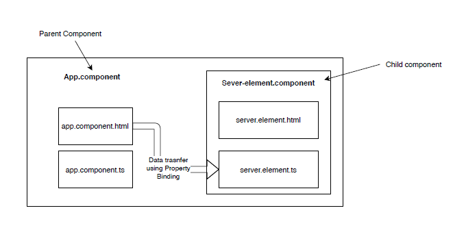
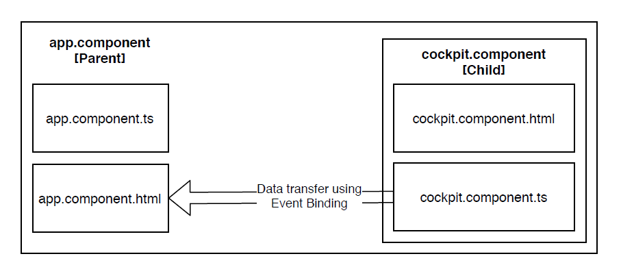
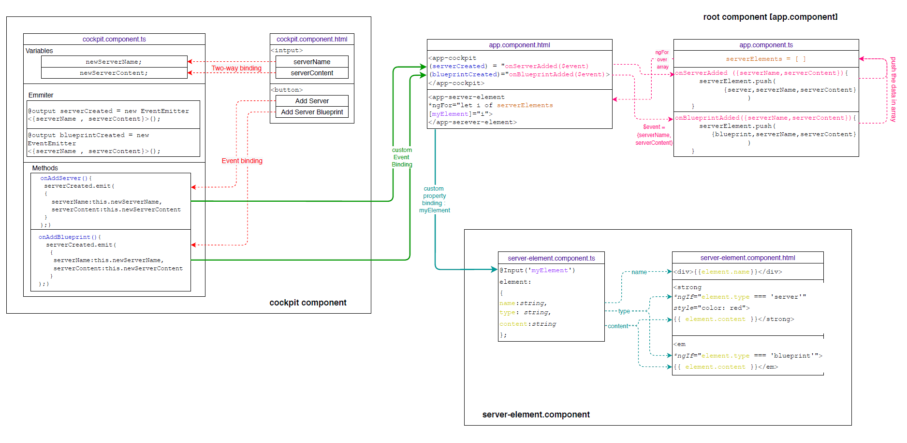

# Deep dive into Binding

## Table of Contents  
* [Need of Custom Bindings](#Need-of-Custom-Bindings)<br>
* [Custom Property Binding Parent to Children](#Custom-Property-Binding-Parent-to-Children)<br>
* [Custom Event Binding Children to Parent](#Custom-Event-Binding-Children-to-Parent)<br>
* [View Encapsulation ](#View-Encapsulation)<br>
* [Local Reference](#Local-Reference)<br>
* [ViewChild](#ViewChild)<br>
* [NgContent](#NgContent)<br>
* [Component Life Cycle](#Component-Life-Cycle)<br>
* [ContentChild](#ContentChild)<br>
* [Project Structure ](#Project-Structure)<br>

## Need of Custom Bindings

1. Segregation of the entire app into several small component is a key development practice
2. While segregating the app, it is highly probable that transfer data between different components occures
3. The data transfer between several components can be easily handled using services
4. Although there is a hard way to doing it, using custom binding
5. There are basically two types of custom binding : Property binding and Event binding

## Custom Property Binding Parent to Children

1. Custom Property binding is used when data transfer needed from HTML file of one component to the TS file of other component

2. The HTML file from where data is being sourced should be the parent component.

3. Example

   1. Parent component : ```app.component```
   2. Child component : ```server-element.component```

4. In above example property binding can be done when the data from ```app.component.html``` needed to transfer to the ```server-element.component.ts```

   

5. ```app.component.ts```

   ~~~typescript
   import { Component } from '@angular/core';
   
   @Component({
     selector: 'app-root',
     templateUrl: './app.component.html',
     styleUrls: ['./app.component.css']
   })
   export class AppComponent { 
       serverElement = {type:'server',name:'Testserver', content:'just a test'};
   }
   ~~~

6. ```app.component.html```

   ~~~html
   <div>
       <app-server-element
        [srvElement] = "serverElement">	<!--call the input property by its alias-->
       </app-server-element>
   </div>
   
   <!--"value" obtained from app.component.ts-->
   ~~~

7. ```server-element.component.ts```

   ~~~typescript
   import { Component, Input} from '@angular/core';
   @Component({
     selector: 'app-server-element',
     templateUrl: './server-element.component.html',
     styleUrls: ['./server-element.component.css']
   })
   export class ServerElementComponent{
       @Input('srvElement') 	// srvElement is alian to the input property and optional
       element:{type: string, name:string, content:string};
   }
   ~~~

8. ```server-element.component.html```

   ~~~html
   <div>
     {{element.type}} | {{element.name}} | {{element.content}}
   </div>
   ~~~

9. ```@input()``` decorator makes property modifiable from outside of the component

10. Above example works only when two component has a parent children relation

## Custom Event Binding Children to Parent

1. Custom Event binding is used when data transfer need from TS file of one component to the HTML file of the another component

2. Same as Property binding, to perform custom event binding the component should have parent children relation

3. Example:

   1. Parent component : ```app.component```
   2. Child component : ```cockpit.component```

4. The data transfer is performed from ```cockpit.component``` to the ```app.component```

   

5. ```app.component.html```

   ~~~typescript
   export class AppComponent {
       onServerAdded(serverData:{serverName:string,serverContent:string}){...}
       onBlueprintAdded(serverData:{serverName:string,serverContent:string}){...}
   }
   ~~~

6. ```app.component.html```

   ~~~html
   <div>
     <app-cockpit 
        (serverCreated)="onServerAdded($event)"
        (blueprintCreated)="onBlueprintAdded($event)">
     </app-cockpit>
   </div>
   <!--$event contains data which was emitted from cockpit.component.ts-->
   ~~~

7. ```cockpit.component.ts```

   ~~~typescript
   export class CockpitComponent{
       @Output() 
       serverCreated = new EventEmitter<{serverName:string, serverContent:string}>();
       
       @Output() 
       blueprintCreated = new EventEmitter<{serverName:string, serverContent:string}>();
       
       onAddBlueprint() {
           this.blueprintCreated.emit(
           	{ 'blueprintServer','bluePrintServerCreated'}
           );
       }
       
       onAddServer() { 
           this.serverCreated.emit(
               {'normalServer','normalServerAdded'}
           );
       }
   }
   ~~~

## View Encapsulation 

1. Angular enforce the encapsulation on the elements of HTML file

2. The style which should apply to the html element should reside in respective component folder

3. Angular internally assign shadow DOM name to the elements of html template 

4. Inter component style mitigation never happens by default  whose 

5. To bypass this feature and apply the style of one component across all the component following is the solution

   ~~~typescript
   // modify the @component decorator of the component whose CSS design should apply globally 
   @Component({
       encapsulation: ViewEncapsulation.none;
   })
   
   options:
   None, Emulated, shadowDom, Native
   ~~~

## Local Reference

1. Using variable inside the HTML template which is declared in the same HTML template

2. This same purpose can be achieved also by property binding and string interpolation

   ~~~html
   <!--component.html-->
   <input type="text" #localRefVal>
   
   <button (click) ="aMethod(localRefVal)">
       a button
   </button>
   ~~~

   ~~~typescript
   // component.ts
   aMethod(inputVar){
       console.log('this is local ref obtained from HTML' + inputVar);
   }
   ~~~

## ViewChild

1. To remember a variable declared in HTML and use it in TS file

2. A common variable between HTML and TS

   ~~~html
   <input type="text" class="form-control" #viewChildVar>
   ~~~

   ~~~typescript
   @ViewChild('viewChildVar', {static: true}) viewChildVar;
   
   showValOfViewChildData(){
       console.log(this.viewChildVar);
   }
   ~~~

## NgContent

1. Calling the child component in parent component as follow

   ~~~html
   <!--using the selector of the component-->
   <app-child>
       <p>
           this paragraph will not be visible by default 
       </p>
   </app-child>
   ~~~

2. The above shown angular default behavior can be modify as follow 

   ~~~html
   <!--modify the child component's html-->
   <div>
       <ng-content></ng-content>
   </div>
   <!--now paragraph written in the parent component will be render in between ng-content tag-->
   ~~~

## Component Life Cycle

1. When component get initialized by angular and added into DOM
2. Angular goes through various process phases
3. Angular provide facility to hook into this phases and execute our code
4. Each phases has its own methods
5. to execute the code, put the code in corresponding life cycle hook
6. Default hooks:
   1. **ngOnChange**:  the code reside in this method(hook) will  be executed multiple times. executes once in the beginning and executes every time when bounded input changes
   2. **ngOnInit**: This method get executed once component instantiated, it runs after constructor
   3. **ngDoCheck**: This method get executed once change detection runs, button clicked get checked too
   4. **ngOnDestroy**: This method get executed when component get destroyed 

## ContentChild

1. By using we can project the content of one component into another component

2. Should be used with ```ng-content``` tag

   ~~~html
   <!--parent component-->
   <app-server>
       <p #localRefOfPara>
           some paragraph
       </p>
   </app-server>
   ~~~

   ~~~html
   <!--app-server component-->
   <div>
       <ng-content>
           paragraph from above component will be render here
       </ng-content>
   </div>
   ~~~

   ~~~typescript
   //app.server.component.ts
   @ContentChild('localRefOfPara')
   para : ElementRef;
   
   // now the paragraph can be access in the TS using "para" name
   ~~~

## Project Structure 

1. Following diagram explains how custom property and event binding facilitate us to perform inter component communication. [code available with the repo of this tutorial]

   

   

